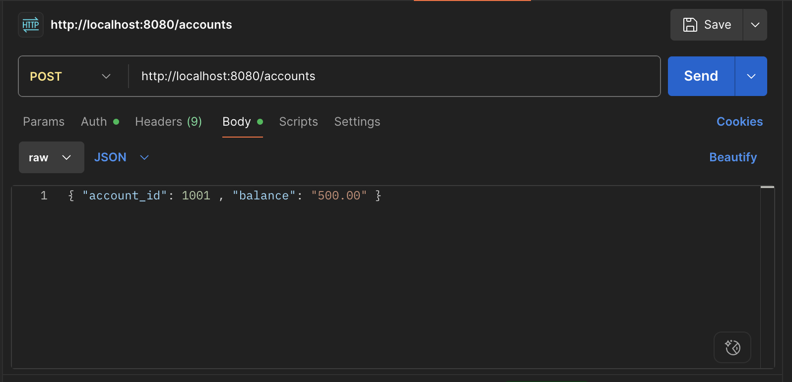
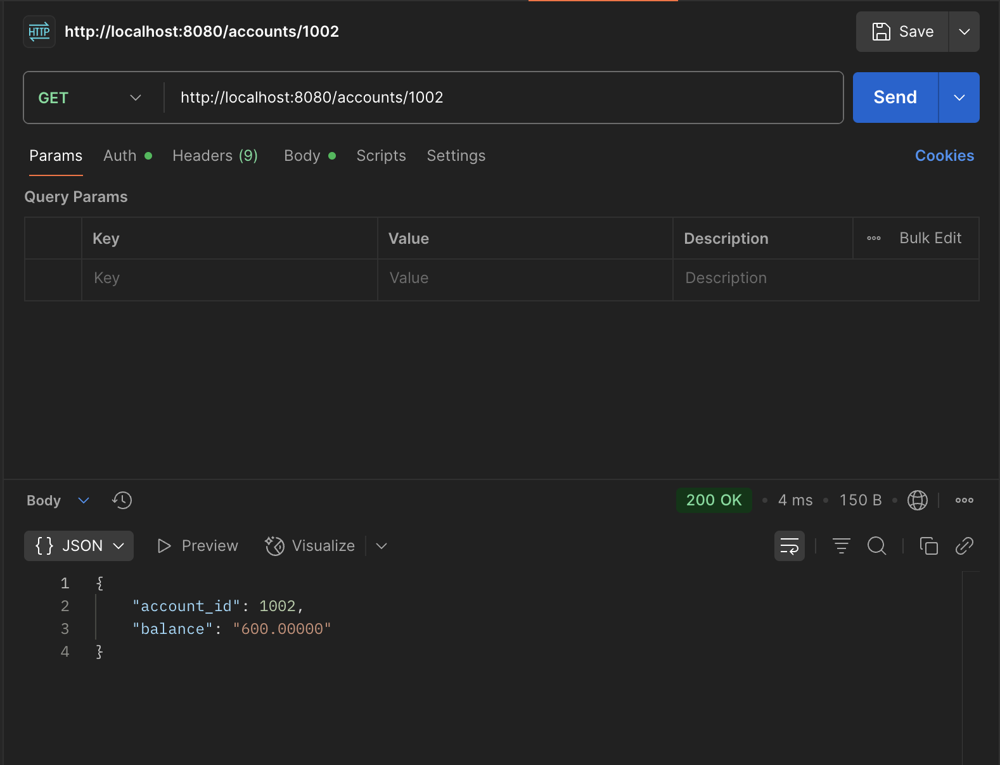
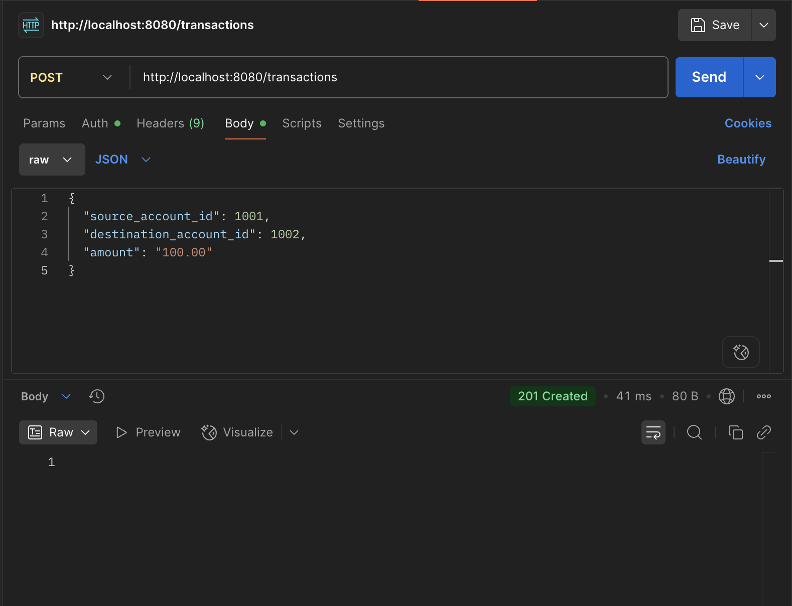
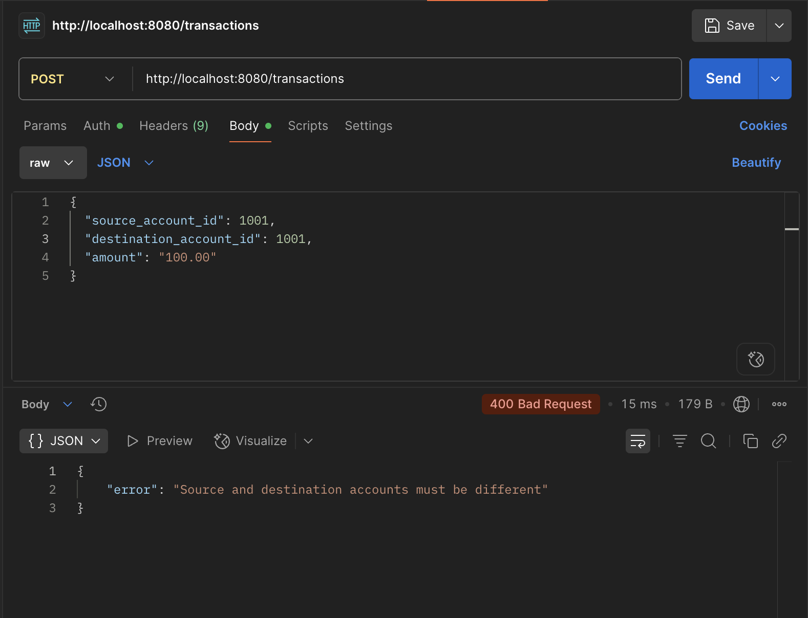

ystem

A backend system for processing internal financial transactions between accounts using **Go** and **PostgreSQL**. Exposes RESTful endpoints for creating accounts, querying balances, and securely transferring funds between accounts.

---

## 📌 Project Overview

This project implements a robust, lightweight internal transfer service using Go. It provides HTTP endpoints for:

- Creating accounts
- Querying account balances
- Processing internal transactions atomically

It ensures data integrity, consistent state transitions, and structured error handling.

---

## 🗂️ Project Structure

```
internal-transfers/
├── go.mod              # Go module definition
├── main.go             # Application entry point
├── db/
│   └── db.go           # DB connection initialization
├── handlers/
│   ├── account.go      # Account handlers
│   ├── transaction.go  # Transaction handler
│   └── utils.go        # Shared error handling function
├── models/
│   └── models.go       # Structs for DB and JSON mapping
└── README.md           # Project documentation
```

---

## ⚙️ Setup Instructions

### 🧱 1. Install Dependencies

- [Go](https://golang.org/doc/install)
- [PostgreSQL](https://www.postgresql.org/download/)

---

## 🗄️ 2. Create Database Schema

### 🔧 Tools Used

- **pgAdmin 4**: Used to create the database `internal_transfers`.
- **psql CLI**: Used to execute SQL schema setup commands.

### 📘 Steps to Setup the Schema

1. Open **pgAdmin 4**:
   - Create a new database named: `internal_transfers`
   - Set owner as `postgres`

2. Open your terminal and connect using `psql`:

```bash
psql -U postgres -d internal_transfers
```

3. Inside the `psql` shell, run:

```sql
CREATE TABLE accounts (
    account_id BIGINT PRIMARY KEY,
    balance NUMERIC(20, 5) NOT NULL
);

CREATE TABLE transactions (
    id SERIAL PRIMARY KEY,
    source_account_id BIGINT,
    destination_account_id BIGINT,
    amount NUMERIC(20, 5) NOT NULL,
    created_at TIMESTAMP DEFAULT CURRENT_TIMESTAMP,
    FOREIGN KEY (source_account_id) REFERENCES accounts(account_id),
    FOREIGN KEY (destination_account_id) REFERENCES accounts(account_id)
);
```

---

### ▶️ 3. Run the Server

```bash
git clone https://github.com/dkotegaonkar/internal-transfers.git
cd internal-transfers
go mod tidy
```

4. In your `db/db.go`, configure the connection string using your credentials:

```go
connStr := "host=localhost port=5432 user=your_user password=your_password dbname=internal_transfers sslmode=disable"
```

Then start the server:

```bash
go run main.go
```

Server will run at:  
📍 `http://localhost:8080`

---

## 🧪 API Testing (via Postman)

### ✅ Create Account

- **Endpoint**: `POST /accounts`

```json
{
  "account_id": 1001,
  "balance": "500.00"
}
```



---

### 📤 Get Account Balance

- **Endpoint**: `GET /accounts/1001`

**Response**:

```json
{
  "account_id": 1001,
  "balance": "500.00000"
}
```



---

### 🔁 Create Transaction

- **Endpoint**: `POST /transactions`

```json
{
  "source_account_id": 1001,
  "destination_account_id": 1002,
  "amount": "100.00"
}
```

#### Successful Transaction
  


#### Self-transfer Error


---

## ✅ Key Features

| Feature                 | Description                                                  |
|-------------------------|--------------------------------------------------------------|
| **Clean endpoints**     | Exposes `/accounts` and `/transactions` with validation      |
| **Atomic operations**   | Uses SQL transactions to ensure atomic debit-credit behavior |
| **Validation**          | Ensures amount > 0, no self-transfer, and valid account IDs  |
| **JSON error responses**| Consistent and structured error messages                     |
| **Modular code**        | Clean separation of models, handlers, database, and utils    |

---

## 🧩 How This Project Meets the Assessment Goals

| Assessment Goal         | How Addressed                                               |
|-------------------------|-------------------------------------------------------------|
| **Endpoint correctness**| All endpoints return expected results with valid/invalid input |
| **Accurate processing** | SQL transactions guarantee atomic, reliable operations      |
| **Code quality**        | Modular structure with clear validation and error handling  |
| **Documentation**       | This `README.md` + inline comments in code                  |
| **Testing**             | Verified via manual Postman testing across valid scenarios  |

---

## 📌 Assumptions

- All accounts use the **same currency**
- No authentication/authorization required
- Amount and balance are sent as **strings in JSON** to preserve precision

---

## 📬 Author

**Dhruv Kotegaonkar**  
GitHub: [@dkotegaonkar](https://github.com/dkotegaonkar)
